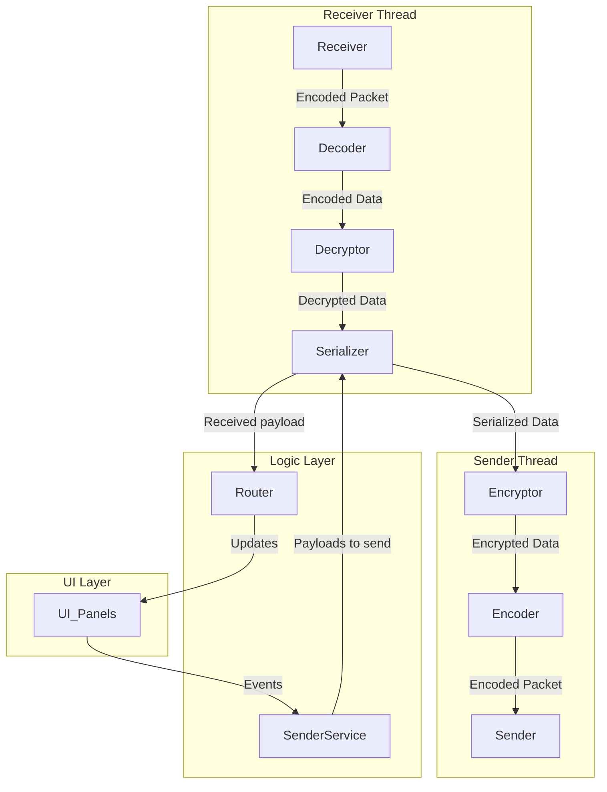

```mermaid
flowchart TD

    subgraph Receiver Thread
        Receiver
        Decoder
        Decryptor
        Serializer
    end

    subgraph Sender Thread
        Serializer
        Encryptor
        Encoder
        Sender
    end
    
    subgraph Logic Layer
        Router
        SenderService
    end

    subgraph UI Layer
        UI_Panels
    end
    
    Receiver -->|Encoded Packet| Decoder
    Decoder -->|Encoded Data| Decryptor
    Decryptor -->|Decrypted Data| Serializer
    Serializer -->|Received payload| Router
    
    Router -->|Updates| UI_Panels
    UI_Panels -->|Events| SenderService

    SenderService -->|Payloads to send| Serializer

    Serializer -->|Serialized Data| Encryptor
    Encryptor -->|Encrypted Data| Encoder
    Encoder -->|Encoded Packet| Sender
```