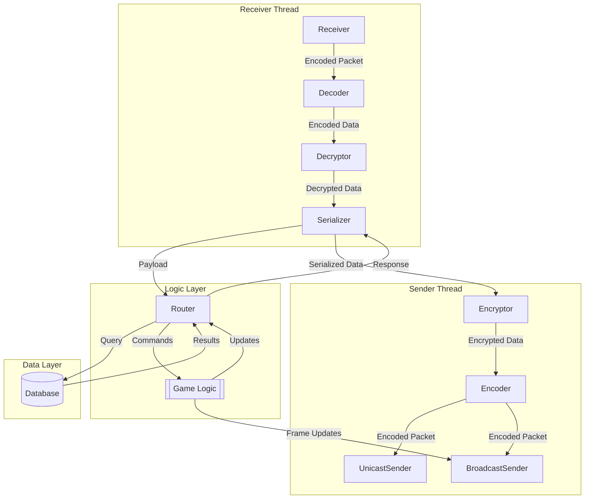

```mermaid
flowchart TD

    subgraph Receiver Thread
        Receiver
        Decoder
        Decryptor
        Serializer
    end

    subgraph Sender Thread
        Serializer
        Encryptor
        Encoder
        UnicastSender
        BroadcastSender
    end
    
    subgraph Logic Layer
        Router
        GameLogic[[Game Logic]]
    end
    
    subgraph Data Layer
        Database[(Database)]
    end
    
    Receiver -->|Encoded Packet| Decoder
    Decoder -->|Encoded Data| Decryptor
    Decryptor -->|Decrypted Data| Serializer
    Serializer -->|Payload| Router
    
    Router -->|Query| Database
    Router -->|Commands| GameLogic
    GameLogic -->|Updates| Router
    Database -->|Results| Router
    
    Router -->|Response| Serializer
    Serializer -->|Serialized Data| Encryptor
    Encryptor -->|Encrypted Data| Encoder
    Encoder -->|Encoded Packet| UnicastSender
    Encoder -->|Encoded Packet| BroadcastSender
    
    GameLogic -->|Frame Updates| BroadcastSender
```